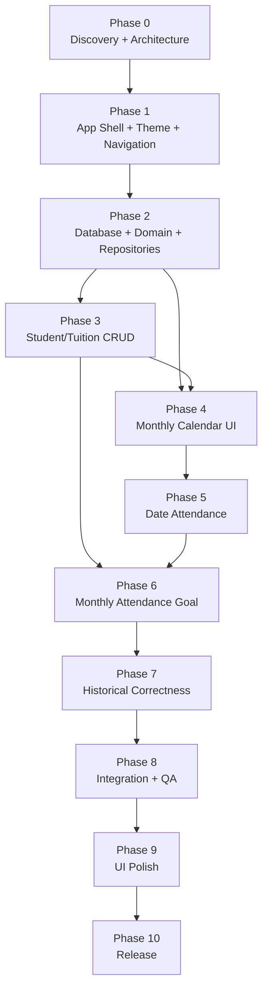

# Implementation Plan — Home Tutor Attendance App

> **Phase-gated execution plan.** This file sequences the Flutter application into small, testable phases.
>
> **Source of truth:** `docs/PRD.md` (authoritative product requirements).
>
> **Reference UI assets:** `docs/google calendar UI screenshot.jpg` and `docs/samsung calendar UI screenshot.jpg`.
>
> **Execution rule:** Complete exactly one phase at a time. At the end of every phase, run verification, build an Android APK, report the result, and **STOP**. Do not begin the next phase until the user explicitly instructs/approves it.

---

## 0. Canonical Contract

| Item | Value |
|---|---|
| **PROJECT** | Home Tutor Attendance |
| **PLATFORM** | Flutter, Android-first |
| **PRIMARY USE** | Personal home-tutor attendance tracking |
| **PRIMARY SCREEN** | Monthly calendar |
| **ARCHITECTURE** | Offline-first, local persistence, layered/testable architecture |
| **SOURCE OF TRUTH** | `docs/PRD.md` |
| **UI REFERENCES** | `docs/samsung calendar UI screenshot.jpg`, `docs/google calendar UI screenshot.jpg` |
| **DOCUMENTS DIRECTORY** | `docs/` contains PRD, implementation plan, and UI references |
| **CURRENT STUDENT COUNT** | Small initially (currently about 4), but the data model/UI must support future growth |
| **ATTENDANCE MODEL** | A student can be manually marked as taught on any date |
| **ROUTINE MODEL** | A tuition has weekly scheduled weekdays; routine history must be preserved |
| **MONTHLY GOAL** | Show actual attended vs scheduled teaching days for currently active students for each of the latest 6 months including current month |
| **NETWORK REQUIREMENT** | Core application must work offline |
| **AUTHENTICATION** | Not required for the initial personal app unless explicitly added later |
| **SERVER/BACKEND** | Not required for MVP |
| **DATA STORAGE** | Local database selected during Phase 0 based on Flutter maturity, migration support, query capability, and testability |
| **THEME** | Light/dark theme with persistence |
| **APK CHECKPOINT** | Mandatory after every phase |
| **PHASE APPROVAL** | Manual user approval required before next phase |

---

# 1. Purpose

This document defines the exact execution process for building the Home Tutor Attendance Flutter application.

The PRD defines the product behavior. This implementation plan defines the engineering sequence.

The application should be built incrementally so the user can install and test a working APK after every phase instead of waiting until the entire application is finished.

## 1.1 Core principles

- `docs/PRD.md` is authoritative for product behavior.
- This file is authoritative for execution order and phase gates.
- UI screenshots in `docs/` are visual references, not functional requirements.
- Do not implement future-phase features early merely because they are convenient.
- Prefer small, reviewable changes.
- Preserve historical attendance accuracy.
- Never allow a student becoming inactive today to erase or corrupt historical attendance.
- Never allow changing a student's current routine to rewrite historical routine calculations.
- The monthly calendar is the most important screen.
- Every phase must produce a testable APK.
- The orchestrator must stop after every phase.

---

# 2. Non-Negotiable Orchestrator Rules

These rules apply to every phase.

## 2.1 One phase at a time

The orchestrator must identify the current phase from this document and work only on that phase.

It must NOT:

- implement future phases;
- refactor unrelated areas;
- add speculative features;
- redesign completed functionality without a reason;
- silently skip incomplete tasks;
- declare a phase complete without running its verification steps.

## 2.2 Multi-agent usage

Kilo Code Orchestrator may use multiple agents, but parallelization must be deliberate.

Before delegating:

1. Identify task dependencies.
2. Identify files likely to be shared.
3. Parallelize only tasks that can safely be developed independently.
4. Avoid having multiple agents modify the same foundational files.
5. The orchestrator remains responsible for integration and review.
6. Never blindly merge sub-agent output.

For small phases, using one agent may be preferable to creating unnecessary coordination overhead.

## 2.3 No automatic phase progression

This is a strict requirement.

After the current phase reaches all exit criteria:

1. Build the APK.
2. Verify that the APK exists.
3. Provide the phase completion report.
4. State the APK path.
5. Stop.

The orchestrator must wait for explicit user instruction such as:

- `continue to phase 2`
- `approved, start next phase`
- `phase 2`
- or equivalent.

It must not infer approval from silence.

## 2.4 Feedback handling

If the user tests the APK and reports a bug:

- classify it first;
- determine which phase owns the bug;
- fix completed-phase bugs before moving forward;
- rerun relevant tests;
- rebuild the APK;
- stop again.

If the feedback is a new feature that belongs to a future phase, record it mentally/document it as future work but do not implement it until that phase is reached, unless the user explicitly requests otherwise.

## 2.5 Existing functionality must not regress

Every phase must verify previously completed functionality.

A phase is not complete if its new feature works but an earlier feature is broken.

---

# 3. Phase Execution Protocol

For **every phase**, follow this exact sequence.

```text
Read phase specification
        ↓
Inspect current implementation
        ↓
Identify tasks and dependencies
        ↓
Plan agent delegation
        ↓
Implement ONLY current phase
        ↓
Review/integrate agent changes
        ↓
Format code
        ↓
Static analysis
        ↓
Run unit/widget/integration tests
        ↓
Run regression checks
        ↓
Fix failures
        ↓
Build Android APK
        ↓
Verify APK exists
        ↓
Prepare phase completion report
        ↓
STOP
        ↓
Wait for user feedback/approval
```

## 3.1 Required phase report

At the end of every phase, report:

```text
PHASE X — COMPLETED

Status:
- Implementation: PASS/FAIL
- Static analysis: PASS/FAIL
- Tests: PASS/FAIL
- APK build: PASS/FAIL

Completed tasks:
- ...

Tests executed:
- ...

APK:
- <exact APK path>

Known issues:
- ...

Notes:
- ...

NEXT STATE:
WAITING FOR USER TESTING / APPROVAL

The next phase will NOT start automatically.
```

---

# 4. Project Architecture

The exact library choices should be validated in Phase 0. Do not assume a package simply because it is popular.

A recommended logical structure is:

```text
lib/
├── app/
│   ├── app.dart
│   ├── router/
│   └── theme/
│
├── core/
│   ├── constants/
│   ├── errors/
│   ├── extensions/
│   ├── utils/
│   └── widgets/
│
├── data/
│   ├── database/
│   ├── models/
│   ├── repositories/
│   └── datasources/
│
├── domain/
│   ├── entities/
│   ├── repositories/
│   └── services/
│
├── features/
│   ├── calendar/
│   ├── attendance/
│   ├── students/
│   ├── monthly_goal/
│   └── settings/
│
└── main.dart
```

The exact folder names may be adjusted during Phase 0 if a simpler architecture is better, but responsibilities must remain separated.

---

# 5. Domain Model Contract

The following concepts must exist regardless of the implementation library.

## 5.1 Student

A student represents the person receiving tutoring.

Required/optional fields must follow `docs/PRD.md`.

At minimum, the domain must support:

- unique identifier;
- student name;
- weekly teaching-day count;
- selected weekdays;
- assigned display color;
- currently teaching/active state;
- teaching start date;
- optional notes/details;
- historical teaching-period relationship.

## 5.2 Teaching Period

A teaching period represents when the tutor actually teaches a student.

It is required so historical monthly reports remain correct.

Conceptually:

```text
TeachingPeriod
- id
- studentId
- startDate
- endDate (nullable)
```

Rules:

- current period has no end date;
- stopping a student closes the active period;
- reactivating/restarting later should create a new period rather than rewriting the old period;
- historical periods must remain immutable except through an explicit correction workflow.

## 5.3 Routine Period

A routine period represents the scheduled weekly teaching weekdays for a particular teaching period.

Conceptually:

```text
RoutinePeriod
- id
- studentId / teachingPeriodId
- effectiveFrom
- effectiveTo (nullable)
- weeklyDays
- weekdays[]
```

Rules:

- `weeklyDays` must equal the number of selected weekdays;
- routine changes create a new routine period;
- previous routine periods are preserved;
- historical scheduled-day calculations use the routine effective during that historical date range.

## 5.4 Attendance Record

Attendance is the fact that the tutor taught a student on a specific date.

Conceptually:

```text
AttendanceRecord
- id
- studentId
- attendanceDate
- createdAt
```

Required invariant:

```text
UNIQUE(studentId, attendanceDate)
```

A student cannot appear twice on the same date.

## 5.5 App Settings

Persistent application-level settings may include:

- theme preference;
- other future local preferences.

---

# 6. Data Rules

## 6.1 Required vs nullable fields

The final schema must explicitly document every field as:

- mandatory/non-nullable;
- optional/nullable;
- defaulted;
- derived;
- immutable after creation where applicable.

Do not make fields nullable merely to simplify forms.

Do not make fields mandatory when the PRD describes them as optional.

## 6.2 Dates

Use date-only semantics for:

- teaching start date;
- teaching end date;
- routine effective dates;
- attendance date.

Do not introduce time-of-day semantics where the product only needs a calendar date.

Avoid timezone-related date shifting.

For example, an attendance entered for September 9 must remain September 9 after:

- app restart;
- database reload;
- timezone changes;
- serialization/deserialization.

## 6.3 Attendance uniqueness

Adding Student X to September 9 twice must not create two attendance records.

The UI should prevent duplicates and the persistence layer must enforce uniqueness.

## 6.4 Historical integrity

Changing:

- current active status;
- current weekly schedule;
- current selected weekdays;
- current student details

must not retroactively change old attendance records.

---

# 7. Business Rules

## 7.1 Weekly routine

If a student is assigned:

```text
Weekly days = 3
Weekdays = Monday, Wednesday, Friday
```

the scheduled teaching dates are generated from those three weekdays only.

The user is not required to manually attend every scheduled date.

Attendance is actual teaching, not an automatic assumption.

## 7.2 Monthly attended count

For a student and month:

```text
Actual = number of unique attendance records in the month
```

## 7.3 Monthly scheduled count

Scheduled days are calculated from:

- the student's applicable teaching period;
- the routine period applicable on each date;
- the month boundaries.

Do not blindly calculate:

```text
weeklyDays × 4
```

because months do not contain exactly four weeks and teaching periods may begin/end mid-month.

## 7.4 Monthly ratio

Display:

```text
Actual / Scheduled
```

Examples:

```text
8 / 10
12 / 12
```

If actual attendance exceeds scheduled days, do not cap the actual count.

Example:

```text
12 / 10
```

is valid.

## 7.5 Monthly goal visibility

The Monthly Attendance Goal screen always displays the latest six consecutive months including the current month.

For each month:

- show only students who were currently teaching during that month;
- a student who stopped before that month should not appear;
- a student who started during that month should appear according to the applicable teaching period;
- historical months must use historical routine information.

---

# 8. Phase Overview

| Phase | Name | Depends on | Primary Scope | APK |
|---:|---|---|---|---|
| **0** | Project discovery, architecture & implementation baseline | None | Validate docs, screenshots, Flutter setup, packages, architecture, test/build pipeline | Yes |
| **1** | App shell, theme & navigation | 0 | App bootstrap, light/dark theme, drawer, routes, empty screens | Yes |
| **2** | Database, models & repositories | 1 | Local persistence, migrations, entities, constraints, repository layer | Yes |
| **3** | Student/Tuition CRUD | 2 | Student list, add/edit/details, routine, active status, color | Yes |
| **4** | Monthly Calendar UI | 2, 3 | Samsung-inspired monthly calendar and student attendance chips | Yes |
| **5** | Date Attendance workflow | 4 | Date details, FAB, student picker, add/remove attendance | Yes |
| **6** | Monthly Attendance Goal | 3, 5 | Six-month attendance calculations and UI | Yes |
| **7** | Historical routine/teaching-period correctness | 6 | Historical scenarios, corrections, integrity hardening | Yes |
| **8** | Full integration, persistence & regression QA | 7 | End-to-end testing, edge cases, restart/persistence testing | Yes |
| **9** | UI polish, accessibility & responsive behavior | 8 | Visual refinement against screenshots and Android UX | Yes |
| **10** | Release candidate & final verification | 9 | Release APK, cleanup, documentation, final acceptance | Yes |

---

# 9. Dependency Graph



## 9.1 Parallelization policy

Some internal tasks may be parallelized, but the phases themselves remain approval-gated and sequential.

Safe examples:

- visual asset inspection + package research during Phase 0;
- independent widget tests + business-rule test design when they do not touch the same files;
- documentation updates + isolated test work.

Avoid parallel agents editing:

- `main.dart`;
- app routing;
- database initialization;
- shared domain models;
- shared repositories;
- theme;
- dependency configuration;
- migration files

at the same time.

---

# 10. Phase 0 — Project Discovery, Architecture & Baseline

## Objective

Establish a reliable Flutter foundation before implementing application functionality.

## Tasks

### 0.1 Read source documentation

- Read `docs/PRD.md` completely.
- Read this `docs/implementation.md` completely.
- Treat PRD requirements as authoritative.
- Extract all explicit functional and non-functional requirements.
- Identify any PRD ambiguities without silently changing requirements.

### 0.2 Inspect UI references

Inspect:

- `docs/samsung calendar UI screenshot.jpg`
- `docs/google calendar UI screenshot.jpg`

Extract visual characteristics relevant to the application:

- calendar density;
- month header;
- weekday header;
- date cell structure;
- current-day highlighting;
- event/attendance placement;
- navigation;
- date detail behavior.

Do not copy Samsung/Google branding, logos, proprietary assets, or exact artwork.

### 0.3 Inspect Flutter environment

Verify:

- Flutter SDK;
- Dart SDK;
- Android SDK;
- Android build tools;
- connected/emulated device if available;
- Java/Gradle compatibility.

### 0.4 Select packages

Evaluate and choose only packages needed for:

- local database;
- state management;
- routing;
- date/calendar utilities;
- testing;
- UUID/ID generation if required.

Do not add packages merely because they are popular.

### 0.5 Define architecture

Document:

- presentation;
- domain;
- data;
- persistence;
- state management;
- navigation;
- dependency injection if used.

### 0.6 Establish test/build pipeline

Create:

- unit test structure;
- widget test structure;
- integration test structure where useful;
- lint configuration;
- formatting conventions.

### 0.7 Baseline APK

The app should build before meaningful feature work starts.

## Exit criteria

- [ ] `docs/PRD.md` has been read.
- [ ] UI screenshots have been inspected.
- [ ] Flutter environment is verified.
- [ ] Architecture is selected.
- [ ] Required dependencies are selected.
- [ ] Test structure exists.
- [ ] Static analysis runs.
- [ ] Android build succeeds.
- [ ] Baseline APK is generated.

## Suggested commit

```text
chore: establish flutter project foundation and architecture
```

## Phase 0 APK

Mandatory.

---

# 11. Phase 1 — App Shell, Theme & Navigation

## Objective

Create the application shell and navigation structure without implementing the complete business features.

## Tasks

### 1.1 Application bootstrap

- Configure `MaterialApp`/equivalent.
- Configure app title.
- Configure localization/date formatting if required.
- Establish root navigation.

### 1.2 Theme

Implement:

- light theme;
- dark theme;
- system/default behavior if appropriate;
- persistent user-selected theme.

The theme toggle belongs at the bottom of the drawer.

### 1.3 Navigation drawer

Implement:

- hamburger button;
- drawer;
- Home;
- Students List;
- Monthly Attendance Goal;
- theme control at bottom.

### 1.4 Placeholder screens

Create functional route targets for:

- Home/Calendar;
- Students;
- Monthly Attendance Goal.

They may initially contain placeholder content.

### 1.5 Navigation behavior

Verify:

- drawer opens/closes;
- selected route is clear;
- Android back works;
- navigation does not create unexpected duplicate routes;
- app reopens on Home.

## Exit criteria

- [ ] App launches.
- [ ] Home is the initial route.
- [ ] Hamburger menu works.
- [ ] All required drawer destinations exist.
- [ ] Light/dark theme works.
- [ ] Theme preference persists after restart.
- [ ] Android back behavior is sensible.
- [ ] Static analysis passes.
- [ ] Relevant widget tests pass.
- [ ] APK builds successfully.

## Suggested commit

```text
feat: add app shell navigation and persistent theme
```

## Phase 1 APK

Mandatory.

---

# 12. Phase 2 — Database, Domain Models & Repositories

## Objective

Implement the persistent local data layer and business-domain foundation.

## Tasks

### 2.1 Database initialization

Implement:

- local database;
- versioning;
- migrations;
- initialization;
- development reset strategy.

### 2.2 Student persistence

Create student table/model with:

- required fields;
- optional fields;
- defaults;
- indexes;
- constraints.

### 2.3 Teaching period persistence

Implement historical teaching periods.

### 2.4 Routine period persistence

Implement historical routine periods.

### 2.5 Attendance persistence

Implement attendance records with unique `(studentId, date)` constraint.

### 2.6 App settings

Persist theme and other required settings.

### 2.7 Repositories

Create repository interfaces and implementations.

Repositories should hide database implementation details from UI.

### 2.8 Domain services

Create pure/testable services for:

- determining active teaching period on a date;
- determining applicable routine on a date;
- generating scheduled dates;
- counting actual attendance;
- calculating monthly totals.

Avoid putting business logic directly into widgets.

### 2.9 Database tests

Test:

- insert;
- update;
- delete/archive behavior;
- uniqueness;
- nullable fields;
- migration;
- historical relationships;
- persistence after reload.

## Exit criteria

- [ ] Database initializes successfully.
- [ ] Migration/version strategy exists.
- [ ] All core models exist.
- [ ] Repository interfaces exist.
- [ ] Attendance uniqueness is enforced.
- [ ] Historical teaching/routine data can be represented.
- [ ] Business calculations are unit-testable.
- [ ] Database tests pass.
- [ ] Static analysis passes.
- [ ] APK builds successfully.

## Suggested commit

```text
feat: add local database domain models and repositories
```

## Phase 2 APK

Mandatory.

---

# 13. Phase 3 — Student/Tuition CRUD

## Objective

Implement complete student/tuition management.

## Tasks

### 3.1 Student list

Display:

- active/currently teaching students;
- inactive/archived students if the PRD requires them;
- assigned color;
- useful summary information.

### 3.2 Add Student

Form must support the PRD-defined fields.

At minimum:

- student name;
- weekly number of teaching days;
- weekdays;
- color;
- currently teaching;
- teaching start date;
- optional details.

### 3.3 Validation

Examples:

- name cannot be empty;
- weekly day count must be valid;
- selected weekdays count must match weekly day count;
- start date must be valid;
- color must be valid;
- required fields cannot be blank.

### 3.4 Teaching-period creation

When a new student is created as currently teaching:

- create teaching period;
- create initial routine period.

### 3.5 Student details

Allow viewing:

- student information;
- current routine;
- current status;
- color;
- relevant teaching information.

### 3.6 Edit Student

Support changing:

- name/details;
- current routine;
- color;
- active status.

Changing routine must create a historical routine boundary rather than rewriting old routine data.

### 3.7 Stop teaching

When current teaching is unchecked:

- close active teaching period;
- preserve historical attendance;
- preserve historical routine.

### 3.8 Reactivation/restart

If the PRD supports reactivation:

- create a new teaching period;
- create the appropriate routine period;
- do not modify historical period data.

### 3.9 Delete policy

Prefer archive/deactivate behavior where deleting would damage historical records.

Hard delete must not be allowed if it would orphan or corrupt attendance history.

## Exit criteria

- [ ] Student list works.
- [ ] Add student works.
- [ ] Edit student works.
- [ ] Student details work.
- [ ] Weekly day validation works.
- [ ] Weekday selection works.
- [ ] Color assignment works.
- [ ] Current teaching toggle works.
- [ ] Teaching periods are created/closed correctly.
- [ ] Routine changes preserve history.
- [ ] Historical attendance is not deleted accidentally.
- [ ] Persistence survives app restart.
- [ ] Tests pass.
- [ ] APK builds successfully.

## Suggested commit

```text
feat: implement student and tuition management
```

## Phase 3 APK

Mandatory.

---

# 14. Phase 4 — Monthly Calendar UI

## Objective

Build the primary Home screen as a Samsung Calendar-inspired monthly calendar.

This is a high-priority UX phase.

## Tasks

### 4.1 Monthly grid

Display:

- current month;
- all required calendar dates;
- weekday headings;
- leading/trailing dates as appropriate;
- correct month boundaries.

### 4.2 Current date

Today's date must be visually highlighted.

The highlight must be obvious in both light and dark themes.

### 4.3 Month navigation

Support:

- previous month;
- next month;
- swipe/gesture if appropriate;
- Today action if included by design.

### 4.4 Attendance chips

For each date:

- load attendance records;
- resolve student;
- use student's assigned color;
- display student's name;
- display multiple students;
- handle overflow.

Recommended behavior for crowded dates:

```text
Student A
Student B
Student C
+2 more
```

Do not let long names destroy the calendar grid.

### 4.5 Empty dates

Dates without attendance remain visually clean.

### 4.6 Calendar performance

Avoid querying the database separately for every cell if that creates excessive queries.

Prefer a month-level attendance query and map results by date.

### 4.7 UI reference matching

Compare implementation against:

- Samsung screenshot for monthly calendar information density;
- Google screenshot for date-detail interaction conventions.

The application should be inspired by the references, not a literal copy.

## Exit criteria

- [ ] Home opens directly to monthly calendar.
- [ ] Current month is correct.
- [ ] Today's date is highlighted.
- [ ] Month navigation works.
- [ ] Student attendance chips appear on correct dates.
- [ ] Student colors are respected.
- [ ] Multiple students can appear.
- [ ] Overflow is handled.
- [ ] Long student names are handled.
- [ ] Dark theme is usable.
- [ ] Calendar survives month changes without incorrect data.
- [ ] Widget tests cover important calendar behavior.
- [ ] APK builds successfully.

## Suggested commit

```text
feat: add monthly calendar home screen
```

## Phase 4 APK

Mandatory.

---

# 15. Phase 5 — Date Attendance Workflow

## Objective

Implement the core daily attendance workflow.

## User flow

```text
Home calendar
   ↓
Tap date
   ↓
Date attendance screen
   ↓
Tap +
   ↓
Student picker
   ↓
Select student
   ↓
Attendance saved
   ↓
Student appears on date
   ↓
Back to calendar
   ↓
Calendar chip appears
```

## Tasks

### 5.1 Date selection

Tapping a calendar date opens its attendance list.

### 5.2 Date attendance screen

Display:

- selected date;
- attendance records for that date;
- student names;
- assigned colors;
- empty state when none exist.

### 5.3 Floating action button

Provide a prominent `+` action.

### 5.4 Student picker

Show students eligible according to PRD rules.

Provide:

- student name;
- assigned color;
- selection behavior;
- search if needed for growth.

### 5.5 Add attendance

On selection:

- create attendance record;
- prevent duplicates;
- update date list immediately.

### 5.6 Remove attendance

Allow removing a student from a date.

Removing attendance must NOT:

- deactivate the student;
- change routine;
- change teaching periods.

It only removes that attendance fact.

### 5.7 Calendar synchronization

Returning to Home must immediately show updated attendance.

## Exit criteria

- [ ] Date can be opened from calendar.
- [ ] Existing attendance appears.
- [ ] Empty state works.
- [ ] FAB works.
- [ ] Student picker works.
- [ ] Student can be added.
- [ ] Duplicate attendance is prevented.
- [ ] Student can be removed.
- [ ] Calendar updates immediately.
- [ ] App restart preserves changes.
- [ ] Tests pass.
- [ ] APK builds successfully.

## Suggested commit

```text
feat: add date attendance entry and student picker
```

## Phase 5 APK

Mandatory.

---

# 16. Phase 6 — Monthly Attendance Goal

## Objective

Implement the six-month attendance summary.

## Tasks

### 6.1 Six-month range

Display:

```text
Current month
Previous month
Previous month
Previous month
Previous month
Previous month
```

Exactly six consecutive months.

### 6.2 Student visibility

For each month:

- show only students who were teaching during that month;
- exclude students who had not started;
- exclude students who had already stopped.

### 6.3 Actual count

Count unique attendance records for the student within the month.

### 6.4 Scheduled count

Calculate scheduled teaching dates from historical teaching/routine periods.

### 6.5 Ratio

Display:

```text
actual / scheduled
```

Examples:

```text
8 / 10
12 / 12
12 / 10
```

### 6.6 Progress visualization

Use a clear progress indicator.

For ratios above 100%, do not make the UI misleading.

### 6.7 Color consistency

Use each student's assigned color consistently.

### 6.8 Month ordering

Current month should be easy to identify and chronological order should be obvious.

## Exit criteria

- [ ] Exactly six months are displayed.
- [ ] Current month is included.
- [ ] Correct historical students appear.
- [ ] Actual counts are correct.
- [ ] Scheduled counts are correct.
- [ ] Routine history is respected.
- [ ] Teaching-period boundaries are respected.
- [ ] Ratios are correct.
- [ ] Above-goal attendance is handled.
- [ ] Tests cover the calculation engine.
- [ ] APK builds successfully.

## Suggested commit

```text
feat: add six-month monthly attendance goals
```

## Phase 6 APK

Mandatory.

---

# 17. Phase 7 — Historical Accuracy & Data Integrity

## Objective

Harden the application's most important business rule: historical accuracy.

## Required scenario catalog

### Scenario A — Student stops teaching

```text
August:
A active

September:
A inactive
```

Expected:

```text
August → A appears
September → A does not appear
```

### Scenario B — New student starts

```text
August:
A, B

September:
B, C
```

Expected:

```text
August → A, B
September → B, C
```

### Scenario C — Routine changes

```text
August:
Monday, Wednesday, Friday

September:
Tuesday, Thursday, Saturday
```

Expected:

- August scheduled count uses Mon/Wed/Fri.
- September scheduled count uses Tue/Thu/Sat.

### Scenario D — Attendance before/after routine change

An attendance record remains valid regardless of later routine changes.

### Scenario E — Student restarts

If a student stops and later resumes:

- previous teaching period remains historical;
- new period starts separately;
- monthly calculations use the correct period.

### Scenario F — Attendance over goal

Example:

```text
Scheduled = 10
Actual = 12
```

Expected:

```text
12 / 10
```

not:

```text
10 / 10
```

### Scenario G — Month boundary

Verify:

- last day of previous month;
- first day of current month;
- first/last day of year;
- February/leap year.

### Scenario H — Duplicate attendance

Adding the same student to the same date twice must remain one record.

## Exit criteria

- [ ] All historical scenarios pass.
- [ ] Teaching-period boundaries are correct.
- [ ] Routine-period boundaries are correct.
- [ ] Attendance remains immutable unless explicitly edited/deleted.
- [ ] Duplicate constraints work.
- [ ] Month-boundary tests pass.
- [ ] Restart persistence tests pass.
- [ ] No known historical-data corruption exists.
- [ ] APK builds successfully.

## Suggested commit

```text
test: harden historical attendance and routine integrity
```

## Phase 7 APK

Mandatory.

---

# 18. Phase 8 — Full Integration, Persistence & Regression QA

## Objective

Verify the application as a complete system.

## End-to-end flow

```text
Create Student A
      ↓
Set 3 weekly days
      ↓
Set Mon/Wed/Fri
      ↓
Set color
      ↓
Mark currently teaching
      ↓
Calendar
      ↓
Open date
      ↓
Add Student A
      ↓
Calendar chip appears
      ↓
Monthly goal updates
      ↓
Restart app
      ↓
All information remains
```

## Tasks

### 8.1 CRUD regression

- add;
- view;
- edit;
- deactivate;
- restart;
- reactivate if supported.

### 8.2 Calendar regression

- month navigation;
- current date;
- attendance chips;
- multiple students;
- empty dates.

### 8.3 Attendance regression

- add;
- remove;
- duplicate;
- persistence.

### 8.4 Monthly report regression

- six months;
- active student filtering;
- scheduled count;
- actual count;
- historical routine.

### 8.5 Theme regression

- light;
- dark;
- restart;
- all major screens.

### 8.6 Android behavior

Test:

- system back;
- app background/foreground;
- rotation if supported;
- different screen sizes;
- small screens;
- large screens.

### 8.7 Performance

Check:

- calendar opening speed;
- month navigation;
- attendance loading;
- student list;
- monthly report.

## Exit criteria

- [ ] End-to-end flow passes.
- [ ] Regression tests pass.
- [ ] Persistence passes.
- [ ] Theme persistence passes.
- [ ] Android navigation passes.
- [ ] No critical UI freeze.
- [ ] No P0/P1 defects remain.
- [ ] APK builds successfully.

## Suggested commit

```text
test: complete integration and regression verification
```

## Phase 8 APK

Mandatory.

---

# 19. Phase 9 — UI Polish, Accessibility & Responsive Behavior

## Objective

Refine the app visually and behaviorally after core functionality is stable.

Do not use this phase to redesign the data architecture.

## Tasks

### 9.1 Calendar visual polish

Refine:

- spacing;
- cell dimensions;
- typography;
- chip height;
- chip corner radius;
- month header;
- weekday header;
- today's highlight;
- overflow treatment.

### 9.2 Samsung-inspired density

Use the provided Samsung screenshot as the main visual reference for:

- information density;
- calendar hierarchy;
- date layout;
- navigation feel.

### 9.3 Google-inspired date details

Use the Google screenshot as a secondary interaction reference for:

- date details;
- event/attendance list;
- add action;
- chronological readability.

### 9.4 Drawer polish

Refine:

- icon alignment;
- selected state;
- spacing;
- theme toggle;
- Android feel.

### 9.5 Student UI

Refine:

- list rows;
- color indicator;
- status;
- forms;
- validation messages.

### 9.6 Monthly goal UI

Refine:

- month headers;
- progress bars;
- ratio readability;
- student colors;
- empty states.

### 9.7 Accessibility

Check:

- touch target sizes;
- contrast;
- semantic labels;
- text scaling;
- dark theme;
- keyboard navigation where relevant.

### 9.8 Responsive layouts

Test different Android screen sizes.

## Exit criteria

- [ ] UI visually reviewed against reference screenshots.
- [ ] Calendar remains readable.
- [ ] Dark theme remains polished.
- [ ] Touch targets are appropriate.
- [ ] Text overflow is handled.
- [ ] Small and large screens work.
- [ ] Accessibility checks pass.
- [ ] No functionality regression.
- [ ] APK builds successfully.

## Suggested commit

```text
refactor: polish calendar and application user experience
```

## Phase 9 APK

Mandatory.

---

# 20. Phase 10 — Release Candidate & Final Verification

## Objective

Produce the final clean Android APK.

## Tasks

### 10.1 Production cleanup

Remove:

- temporary debug UI;
- test-only screens;
- fake production data;
- unnecessary logging;
- dead code.

Do not remove useful development migration mechanisms unless safe.

### 10.2 App identity

Verify:

- application name;
- package/application ID;
- version;
- app icon;
- Android configuration.

### 10.3 Database safety

Verify:

- migrations;
- fresh installation;
- existing database upgrade;
- no accidental destructive migration.

### 10.4 Final testing

Run:

- unit tests;
- widget tests;
- integration tests;
- static analysis;
- release build.

### 10.5 Final APK

Build a release APK.

Record exact location.

### 10.6 Final documentation

Update:

- README;
- setup instructions;
- architecture notes;
- known limitations;
- test instructions.

## Exit criteria

- [ ] Clean installation works.
- [ ] Existing database upgrade works.
- [ ] All automated tests pass.
- [ ] Static analysis passes.
- [ ] Release APK builds successfully.
- [ ] No real secrets exist.
- [ ] No test data ships unintentionally.
- [ ] Final PRD requirements are verified.
- [ ] README is complete.
- [ ] Final APK path is reported.

## Suggested commit

```text
chore: prepare release candidate and final verification
```

## Phase 10 APK

Mandatory final release APK.

---

# 21. Testing Strategy

## 21.1 Unit tests

Business logic must be tested independently from Flutter widgets.

Minimum coverage areas:

- weekly-day validation;
- weekday count;
- teaching-period lookup;
- routine-period lookup;
- scheduled-day generation;
- actual attendance count;
- monthly ratio;
- six-month range;
- active-student filtering;
- month boundaries;
- duplicate attendance rules.

## 21.2 Widget tests

Cover:

- drawer;
- theme switch;
- student list;
- student form;
- calendar;
- today's highlight;
- attendance chips;
- date attendance screen;
- FAB;
- student picker;
- monthly goal.

## 21.3 Integration tests

Cover the main workflow:

```text
Create → Schedule → Calendar → Attendance → Monthly Goal
```

Also:

```text
Restart → Verify persistence
```

and:

```text
Deactivate student → Verify historical monthly visibility
```

## 21.4 Manual APK testing

The user is the primary visual acceptance tester.

Every phase APK should be tested manually before approval.

---

# 22. Bug Severity

Use this classification when the user reports issues.

| Severity | Meaning | Action |
|---|---|---|
| **P0** | App cannot launch, data loss, database corruption | Fix immediately before anything else |
| **P1** | Core attendance/calendar workflow broken | Fix before next phase |
| **P2** | Feature partially broken but workaround exists | Normally fix before next phase |
| **P3** | Minor UI/polish issue | May be recorded for polish phase |
| **P4** | Enhancement/request | Put into appropriate future phase |

Examples:

### P0

- attendance database gets deleted;
- app crashes on launch;
- migration destroys existing records.

### P1

- adding attendance does not save;
- calendar shows attendance on wrong date;
- monthly calculation is wrong;
- historical student visibility is wrong.

### P2

- student picker search fails;
- some overflow behavior is poor.

### P3

- spacing slightly differs from screenshot;
- icon alignment issue.

---

# 23. APK Build Protocol

The exact command should be determined from the Flutter project configuration, but the orchestrator must use the appropriate Flutter Android build command.

Typical debug testing build:

```bash
flutter build apk --debug
```

Typical release candidate build:

```bash
flutter build apk --release
```

Before claiming success:

1. command must exit successfully;
2. expected APK must exist;
3. file must have non-zero size;
4. report exact path.

Do not merely say "APK built" without verifying the artifact.

---

# 24. Development Data Strategy

During development, deterministic test data may be created for local testing.

Example:

```text
Student A
Weekly: 3 days
Days: Monday, Wednesday, Friday
Color: Color 1
Active: Yes

Student B
Weekly: 2 days
Days: Tuesday, Thursday
Color: Color 2
Active: Yes

Student C
Weekly: 3 days
Days: Saturday, Sunday, Monday
Color: Color 3
Active: No
```

However:

- test data must not unintentionally ship in the final release;
- production users should start with an empty student list unless the PRD specifies otherwise;
- automated tests should use isolated fixtures.

---

# 25. Important Edge Cases

The implementation must consider:

1. Student name is long.
2. Two students have similar names.
3. Student has no attendance.
4. Date has many students.
5. Student is inactive.
6. Student starts mid-month.
7. Student stops mid-month.
8. Student changes routine mid-month.
9. Student has more actual attendance than scheduled.
10. Month contains five occurrences of a weekday.
11. Month starts/ends mid-week.
12. February.
13. Leap year.
14. Year transition.
15. App restart.
16. Theme restart.
17. Duplicate attendance.
18. Empty student list.
19. Empty date attendance list.
20. Empty monthly report.
21. Very small Android screen.
22. Large Android screen.
23. Dark theme.
24. Long routine/student details.
25. Database migration after an app update.

---

# 26. Documentation Rules

Keep documentation organized under:

```text
docs/
├── PRD.md
├── implementation.md
├── google calendar UI screenshot.jpg
└── samsung calendar UI screenshot.jpg
```

Do not recreate a `skills/` directory for this project unless explicitly requested.

The screenshots are reference material and should remain unchanged.

If additional engineering documentation becomes necessary, add it under `docs/` and update this plan accordingly.

---

# 27. Definition of Done

The entire project is complete only when all of the following are true:

## Product

- [ ] App opens to monthly calendar.
- [ ] Current date is highlighted.
- [ ] Calendar displays attendance by student.
- [ ] Student colors are visible.
- [ ] Multiple students can be taught on one date.
- [ ] Date can be opened to inspect attendance.
- [ ] Attendance can be added.
- [ ] Attendance can be removed.
- [ ] Student CRUD works.
- [ ] Weekly schedule works.
- [ ] Current teaching status works.
- [ ] Historical teaching periods are preserved.
- [ ] Historical routines are preserved.
- [ ] Monthly six-month summary works.
- [ ] Historical active-student filtering works.
- [ ] Light/dark theme works.
- [ ] Theme persists.

## Data

- [ ] Required fields are non-nullable.
- [ ] Optional fields are nullable where appropriate.
- [ ] Defaults are documented.
- [ ] Attendance uniqueness is enforced.
- [ ] Historical records are not corrupted by current edits.
- [ ] Database migrations work.

## Quality

- [ ] Unit tests pass.
- [ ] Widget tests pass.
- [ ] Integration tests pass.
- [ ] Static analysis passes.
- [ ] No P0/P1 bugs remain.
- [ ] App works after restart.
- [ ] Release APK builds successfully.

## UX

- [ ] Calendar is Samsung-inspired.
- [ ] Date-detail workflow is Google Calendar-inspired.
- [ ] No proprietary branding/assets have been copied.
- [ ] Dark mode is usable.
- [ ] Long names and crowded dates are handled.
- [ ] Android navigation behaves naturally.

---

# 28. Final Acceptance Checklist

Before declaring the project finished, perform this exact manual scenario.

```text
1. Open app
   → Monthly calendar appears

2. Confirm today's date
   → Today's date is highlighted

3. Open drawer
   → Home / Students / Monthly Goal visible

4. Switch dark theme
   → Entire application updates

5. Restart app
   → Dark theme remains

6. Add Student A
   → Name + weekly days + weekdays + color + active status

7. Return to calendar
   → Student exists

8. Open yesterday's date
   → Attendance screen opens

9. Tap +
   → Student picker opens

10. Select Student A
    → Attendance appears

11. Go back
    → Student A appears under the correct calendar date

12. Add another student to same date
    → Both students appear with their colors

13. Remove one
    → Only remaining student appears

14. Open Monthly Goal
    → Six months displayed

15. Verify current month
    → Actual/scheduled is correct

16. Deactivate Student A
    → A no longer appears as currently teaching

17. Check historical month
    → A remains visible where historically applicable

18. Change a student's routine
    → Future calculation changes

19. Recheck old month
    → Old calculation remains unchanged

20. Restart app
    → All data remains

21. Build release APK
    → Build succeeds
```

If any critical step fails, the project is not complete.

---

# 29. Phase Approval Protocol

The orchestrator must treat user approval as a hard gate.

Example:

```text
Phase 3 completed.
APK generated.
Waiting for user testing.

User:
"Looks good. Continue to Phase 4."

Only now:
→ Begin Phase 4.
```

If the user says:

```text
"Phase 3 has a problem: editing routine doesn't work."
```

Then:

```text
→ Fix Phase 3
→ Test
→ Build APK
→ Report
→ STOP
```

Do not begin Phase 4.

---

# 30. Orchestrator Start State

When the user first starts Kilo Code with this project, the orchestrator should begin at:

```text
PHASE 0
```

It must first inspect:

```text
docs/PRD.md
docs/implementation.md
docs/google calendar UI screenshot.jpg
docs/samsung calendar UI screenshot.jpg
```

Then inspect the existing Flutter project.

It must not start implementing the complete app immediately.

It must execute only Phase 0, build the baseline APK, report results, and stop.

---

# 31. Suggested Commit Sequence

Use small, understandable commits.

```text
chore: establish flutter project foundation and architecture
feat: add app shell navigation and persistent theme
feat: add local database domain models and repositories
feat: implement student and tuition management
feat: add monthly calendar home screen
feat: add date attendance entry and student picker
feat: add six-month monthly attendance goals
test: harden historical attendance and routine integrity
test: complete integration and regression verification
refactor: polish calendar and application user experience
chore: prepare release candidate and final verification
```

Commit names are suggestions, not a substitute for verification.

---

# 32. Final Rule

> **Never optimize for finishing the whole project quickly. Optimize for producing one correct, testable phase at a time.**

The desired development loop is:

```text
PLAN
  ↓
IMPLEMENT ONE PHASE
  ↓
TEST
  ↓
BUILD APK
  ↓
USER TESTS
  ↓
FEEDBACK
  ↓
FIX IF NEEDED
  ↓
USER APPROVES
  ↓
NEXT PHASE
```

**End of Implementation Plan.**

Authoritative product requirements: `docs/PRD.md`.

UI references: `docs/google calendar UI screenshot.jpg`, `docs/samsung calendar UI screenshot.jpg`.
